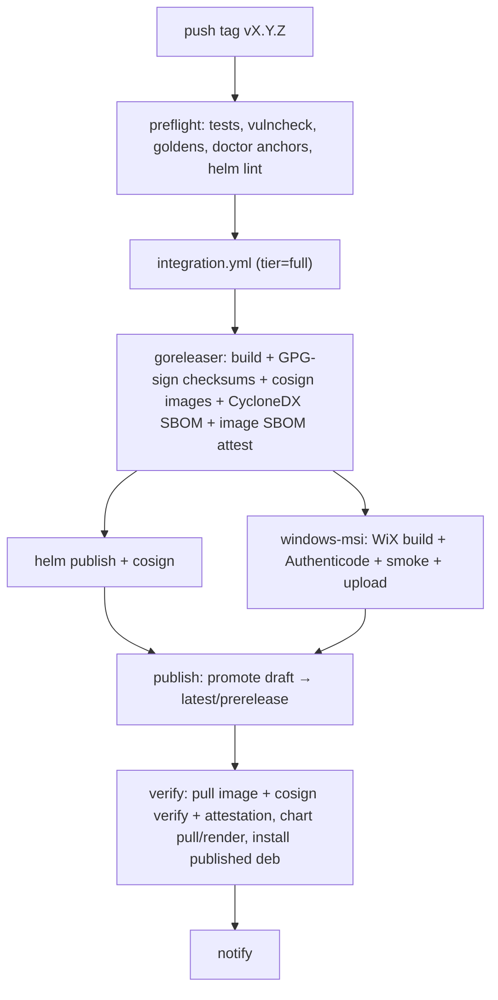

# CI/CD pipeline

How Conduit goes from a pushed commit to a signed, verified, published
release. The build/test/sign/publish/verify steps are fully automated; a
maintainer only picks the version and pushes a tag (see the
[release runbook](runbook.md)).

## Workflows

| Workflow | Trigger | What it does |
|---|---|---|
| [`ci.yml`](../../.github/workflows/ci.yml) | every PR + push to `main` | lint, unit tests (Linux/macOS/Windows), cross-compile every GOOS/GOARCH, goldens, doctor anchors, govulncheck, and the **integration smoke** gate |
| [`integration.yml`](../../.github/workflows/integration.yml) | `workflow_call` only | reusable per-platform integration suite (`tier: smoke` or `full`) — the single source of truth shared by CI, nightly, and release |
| [`nightly.yml`](../../.github/workflows/nightly.yml) | cron 07:00 UTC + manual dispatch | runs `integration.yml` at `tier: full` |
| [`release.yml`](../../.github/workflows/release.yml) | `vX.Y.Z` tag | preflight → full integration gate → goreleaser (build + sign + SBOM) → helm publish + Windows MSI → publish → post-publish verify → notify |

## The integration tiers

`integration.yml` is one reusable workflow with a `tier` input so CI,
nightly, and release can never test different things:

- **`smoke`** (every PR, required to merge): on every OS/arch we publish
  (Linux amd64/arm64, macOS amd64/arm64, Windows amd64) build the binary,
  boot it, and verify a real OTLP roundtrip via the debug exporter.
- **`full`** (nightly + release gate): smoke **plus** the heavy
  install-lifecycle suite —
  - deb install → systemd service start → OTLP → uninstall (native runner)
  - rpm + archlinux install → OTLP → uninstall (containers)
  - container image build (amd64 + arm64) → run → OTLP roundtrip
  - kind + helm end-to-end trace
  - OBI (eBPF) on kind end-to-end trace

Every job reuses [`scripts/smoke_otlp.sh`](../../scripts/smoke_otlp.sh) and
[`scripts/package_install_test.sh`](../../scripts/package_install_test.sh),
so the exact same checks run locally:

```sh
make smoke-host          # binary boot + OTLP roundtrip on this host
make deb-install-test    # deb lifecycle in a Debian container
make rpm-install-test    # rpm lifecycle in a Fedora container
make arch-install-test   # archlinux lifecycle in an Arch container
make kind-smoketest      # kind + helm end-to-end
```

## Release pipeline



## Signing

| Artifact | Mechanism | Inputs |
|---|---|---|
| `checksums.txt` (covers deb/rpm/archlinux/tar.gz by SHA-256) | GPG detached signature (goreleaser `signs:`) | `GPG_PRIVATE_KEY`, `GPG_PASSPHRASE`, `GPG_FINGERPRINT` |
| Container images | cosign **keyless** (Sigstore/Fulcio/Rekor) (`docker_signs:`) | none — `id-token: write` |
| Image SBOM (CycloneDX) | cosign attestation (`cosign attest`) | none — keyless |
| File SBOMs (per archive/package) | syft CycloneDX (goreleaser `sboms:`) | none |
| Helm chart | cosign keyless | none |
| `conduit.exe` + `.msi` | Authenticode (`signtool`) | `WINDOWS_CERT_BASE64`, `WINDOWS_CERT_PASSWORD` |

GPG and Authenticode steps are secret-gated: if the secret is absent (e.g. a
fork), the step is skipped and the rest of the pipeline still runs, so a
release rehearsal works without key material. cosign keyless needs no
secrets.

The release signing key's **public** half is published at
[`docs/release/signing-key.asc`](signing-key.asc) (fingerprint
`3B2A5C2A139F13290FA468BC6D4C5ADC84C5FEAA`) so operators can verify
`checksums.txt.sig`.

## Required GitHub secrets

| Secret | Used by | Purpose |
|---|---|---|
| `GPG_PRIVATE_KEY` | release goreleaser | imported into the keyring to sign `checksums.txt` |
| `GPG_PASSPHRASE` | release goreleaser | unlocks the imported key |
| `GPG_FINGERPRINT` | release goreleaser | selects the signing key (`gpg --local-user`) |
| `WINDOWS_CERT_BASE64` | release windows-msi | base64 of the Authenticode signing cert (`.pfx`) |
| `WINDOWS_CERT_PASSWORD` | release windows-msi | password for the `.pfx` |
| `GITHUB_TOKEN` | all | provided automatically; ghcr.io push, release edits, MSI upload |

> The Authenticode steps assume a PFX consumed by `signtool`. If your cert is
> token-based (Azure Trusted Signing, DigiCert KeyLocker, an HSM), the
> `windows-msi` job's sign steps need to swap `signtool /f` for the
> provider's signing flow.

## Verification (operators)

```sh
# Container image: signature + SBOM attestation
cosign verify ghcr.io/conduit-obs/conduit-agent:vX.Y.Z \
  --certificate-identity-regexp 'https://github.com/conduit-obs/.*' \
  --certificate-oidc-issuer https://token.actions.githubusercontent.com
cosign verify-attestation --type cyclonedx ghcr.io/conduit-obs/conduit-agent:vX.Y.Z \
  --certificate-identity-regexp 'https://github.com/conduit-obs/.*' \
  --certificate-oidc-issuer https://token.actions.githubusercontent.com

# Linux packages: GPG-signed checksums. Import the release public key once:
#   gpg --import docs/release/signing-key.asc
# Release signing key fingerprint: 3B2A5C2A139F13290FA468BC6D4C5ADC84C5FEAA
gpg --verify checksums.txt.sig checksums.txt && sha256sum -c checksums.txt

# Windows MSI: Authenticode
signtool verify /pa /v conduit_X.Y.Z_windows_amd64.msi
```
